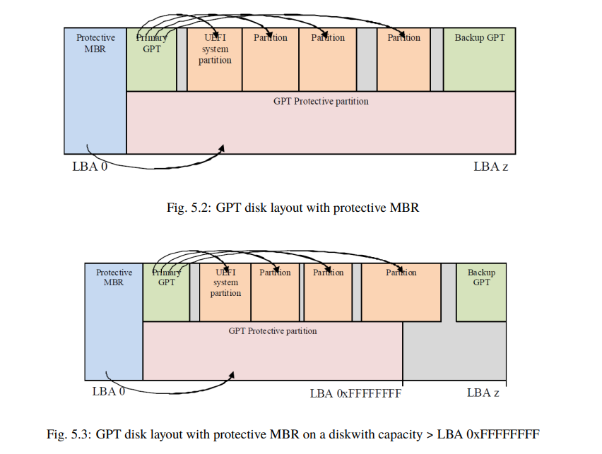

A GPT disk image must have a valid "protective" MBR at it's beginning.

It is called "protective" because in case you use a legacy disk partitioning tool, it might think the disk is unpartitioned and try to partition it with only MBR, causing the GPT table which comes later to be corrupted, making the whole disk useless.

So we create a packed MBR struct by reading the spec. It should be exactly 512 bytes.

Section 5.2.3 shows exactly what a Protective MBR looks like along with all the values.

The first primary partition entry in the MBR is what determines how much of the disk is protected via the MBR, this is at max 2TB, to do this, the `startingCHS`, `endingCHS`, `startingLBA`, `sizeInLBAs` fields are used for the addressing.

Where the "starting__" fields are supposed to point to where the first primary partition of the Protective MBR begins, which is the 2nd sector right after the MBR ends, i.e, LBA 1.

The "ending__" fields determine how large the partition is, it should be calculated based on the size of the disk, for now we will assume the disk is the max size that MBR can handle and set the fields to max possible values.

This still does not guarantee that the whole disk is protected, only up to 2TB will be protected.

To begin, first we have to know what the "disk" configuration is, for example what is the disk capacity, how large is 1 LBA, is it 512B or 4KiB?

To store all of this we create a "disk" struct which will contain this metadata about the disk.

1. For now we'll assume that the LBA size is 512B.

2. The first GPT partition will be the EFI System Partition (ESP) which is supposed to have a FAT32 filesystem
	1. The FAT32 filesystem requires some minimum clusters and shit according to it's own specification which makes it such that a FAT32 filesystem partition needs to be 32MiB minimum, for extra padding we'll use 33MiB to be safe.
	
3. There could be an additional "data partition" supporting/storing extra files for the EFI System Partition, this is probably optional but we'll dedicate a 1MiB partition for this to be safe.

We'll make it such that these values are changeable via flags when running the utility program, but hardcode these default values.

Note that incase the LBA size of the disk is greater than 512 B, the rest should be filled with 0s.

